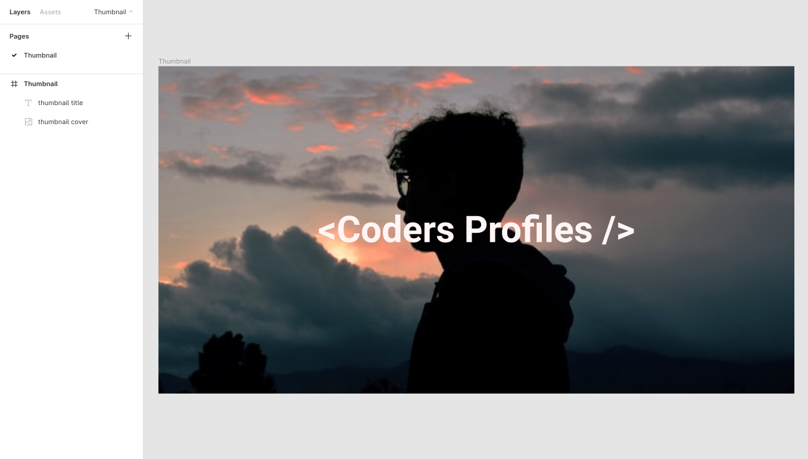

# Designing things

In this directory (`design`) are all things related to the design of the website.

## Directories

- `figma`

### Figma

In the `figma` directory are the things for the figma designs:

- Images
- Colors palette
- Icons

Also, this directory is structured according to the pages of the figma project,
for instance, the **thumbnail** directory was created because I have a page called **thumbnail**
in figma for this project.

Here it's an example:
